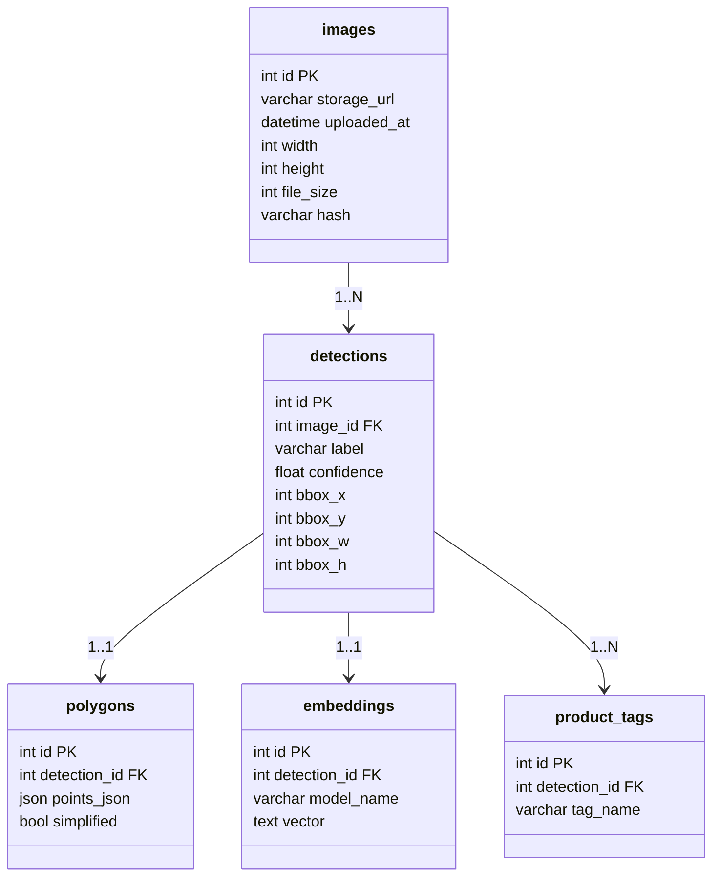

# Database Design

# Sơ đồ mermaid



# Sơ đồ ascii

```asciidoc
+------------------+
|     images       |
+------------------+
| id (PK)          |
| storage_url       |
| uploaded_at       |
| width             |
| height            |
| file_size         |
| hash              |
+------------------+
          |
          | 1:N
          v
+---------------------------+
|       detections          |
+---------------------------+
| id (PK)                   |
| image_id (FK->images)     |
| label (e.g. shirt, pant)  |
| confidence                |
| bbox_x                    |
| bbox_y                    |
| bbox_w                    |
| bbox_h                    |
+---------------------------+
          |
          | 1:1 (optional)
          v
+---------------------------+
|       polygons            |
+---------------------------+
| id (PK)                   |
| detection_id (FK)         |
| points_json (JSON array)  |
| simplified (bool)         |
+---------------------------+

          |
          | 1:1 (optional)
          v
+---------------------------+
|       embeddings          |
+---------------------------+
| id (PK)                   |
| detection_id (FK)         |
| model_name                |
| vector (JSON or TEXT)     |
+---------------------------+


+---------------------------+
|      product_tags         |
+---------------------------+
| id (PK)                   |
| detection_id (FK)         |
| tag_name                  |
+---------------------------+

```
